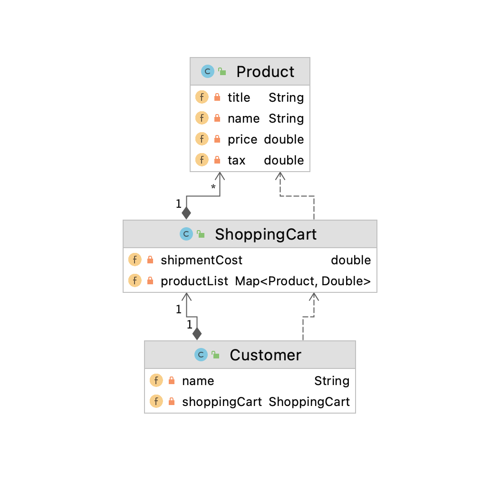

# Shopping App

### UML Diagram



### Assumptions
1. Shipment Cost is a constant.
1. Tax is not included in the product price.
1. Shopping Cart Total is calculated using following formula:
```
total = (product_price*quantity)+(product_tax*quantity)+shipping_cost;
```

### How to Build and Run
1. This project runs on JDK8.
1. Run following maven command to build the project in the shoppin-app folder.
```bash
$ mvn clean install
```
1. Run the executable jar file to start the program.
```bash
$ java -jar ./target/shopping-app-1.0-SNAPSHOT.jar
Customer{ name='John Doe',shoppingCart=Optional[ShoppingCart{total=207.5, vat=7.5, shipmentCost=50.0, productList={Product{, title='Rice', name='Samba Rice', price=100.0, tax=5.0}=1.5}}]}
Customer{ name='Jane Doe',shoppingCart=Optional[ShoppingCart{total=376.0, vat=25.0, shipmentCost=50.0, productList={Product{, title='Dal', name='Red Dal', price=100.5, tax=10.0}=2.0, 
Product{, title='Rice', name='Samba Rice', price=100.0, tax=5.0}=1.0}}]}
```